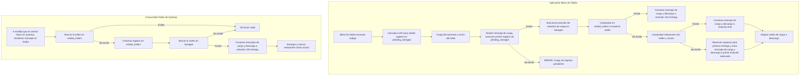

```mermaid
graph TD;
    subgraph Aplicación Mesa de Toldos
        A[Mesa de toldos escanea código] --> B[Llamada a API para añadir registro en pending_storages];
        B --> C[Carga del ascensor y envío del toldo];
        C --> D[Recibir mensaje de carga, consumir primer registro de pending_storages];
        D -- Existe --> E[Marcamos posición de estación de carga en storages];
        D -- No existe --> F[ERROR: Carga sin registro pendiente];
        E --> G[Comprobar en ended_orders si existe la orden];
        G -- Existe --> H[Creamos mensaje de carga y descarga a estación 102 entrega];
        G -- No existe --> I[Comprobar estaciones con orden y vacías];
        I -- Existe --> J[Creamos mensaje de carga y descarga a estación final];
        J --> K[Asignar orden de carga a descarga];
        I -- No existe --> L[Reservar espacios para próxima entrega y crear mensaje de carga y descarga a primer estación reservada];
        L --> K;
    end

    subgraph Consumidor Kafka de Quartup
        M[A medida que se cierran fases en Quartup, recibimos mensaje en Kafka] --> N[Buscar la orden en ended_orders];
        N -- Existe --> O[No hacer nada];
        N -- No existe --> P[Creamos registro en ended_orders];
        P --> Q[Buscar la orden en storages];
        Q -- No existe --> O;
        Q -- Existe --> R[Creamos mensajes de carga y descarga a estación 100 entrega];
        R --> S[Entregar y marcar estaciones como vacías];
    end
```
